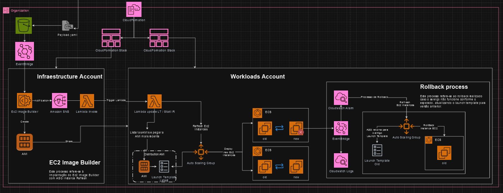

# Automação para criação de uma golden image utilizando Ec2 Image Builder

Esse documento tem como objetivo explicar de forma resumida como construimos uma golden image utilizando Ec2 Image Builder, para deployar a nova AMI em um AutoScaling que fornece instâncias a um Cluster ECS e iniciar uma atualização de instâncias com rollback automatico baseado em eventos do ECS. \
*Conforme diagrama:*

## Processo
O processo terá a criação em uma conta de infraestrutura e automação nas contas de workload para utilização dessa imagem.

Na conta de Infraestrutura temos o Ec2 Imagebuilder que será iniciado quando um eventbridge detectar eventos de *PutObject* em um determinado bucketS3(*esses objetos devem ser payloads no formato bash*) iniciará o processo de criação de uma AMI e compatilhará essa AMI com toda organização; Um SNS irá capturar o evento de lançamento da imagem e com isso irá invocar um lambda. Esse lambda irá invocar os lambdas nas contas de Workload, para que esses lambdas consigam atualizar o launchtemplate dos receptores dessa imagem, para que inicie-se uma atualização de instâncias com um rollback automatico. O rollback automatico basea-se em eventos do service ECS, onde se ocorrer algum erro relacionado a instância ou a AMI nova, um alarme será disparado iniciando-se o processo de rollback.

## Pre-Requisitos

1. CloudTrail: *Um cloudtrail para olhar eventos de um bucketS3*;
2. Subnet Pública;
3. Grupo de segurança: *Porta 443 aberta*;
4. LaunchTemplate;
5. Autoscaling;
6. Cluster ECS;

### Template para conta de infraestrutura
Este template CloudFormation cria uma infraestrutura para a atualização automática de AMIs (Amazon Machine Images) em um Auto Scaling Group utilizando o EC2 ImageBuilder. Ele inclui uma função Lambda que automatiza o processo de atualização de Launch Templates e inicia o processo de Instance Refresh no Auto Scaling Group.
Parâmetros

* EnvironmentName: O nome do ambiente. Padrão: "".
* AmazonLinux2023EcsOptimizedAmiId: O ID da AMI otimizada para ECS. Padrão: "".
* BuildInstanceType: O tipo de instância para o Image Builder. Padrão: "".
* PublicSubnet: O ID da subnet pública. Padrão: "".
* DefaultSecurityGroup: O ID do grupo de segurança padrão para o Image Builder. Padrão: "".
* BucketName: O nome do bucket para carregar o payload. Padrão: "".
* AWSOrgID: O ID da organização. Padrão: "".
* InvokeInstanceRefreshHandlerRole: O nome da role Lambda para invocar o Instance Refresh. Padrão: "".
* AccountOrganization: O ID da organização da conta. Padrão: "".

**Recursos**

*Lambda Function:* InvokeLambdaHandler
* *Uma função Lambda responsável por: \
    Listar todas as contas na organização.\
    Assumir a role nas contas e invocar uma função Lambda em cada conta.\
    Iniciar o processo de Instance Refresh no Auto Scaling Group.* 

**Propriedades:**
*FunctionName:* Lambda-Invoke-Another-LambdaInMultiAccout-For-InstanceRefresh\
*Handler: lambda_function.lambda_handler\
Runtime: python3.8\
MemorySize: 128\
Timeout: 120*\

*IAM Role:* InvokeHandlerLambdaRole
* *Uma role IAM associada à função Lambda, permitindo que ela realize as seguintes ações:\
Acesso total ao EC2 (AmazonEC2FullAccess).\
Gerenciamento de logs no CloudWatch.\
Atualização e gerenciamento de Auto Scaling Groups.\
Criação de versões de Launch Templates.\
Acesso a recursos S3.\
Criação de alarmes no CloudWatch.\
Passagem de roles para o serviço EC2.*

*IAM Role:* InvokeInstanceRefreshHandlerRole 
* *Uma role IAM criada para permitir a invocação da função Lambda de atualização doLaunch Template e Instance Refresh de outra conta.*

*EventBridge Rule:* EventBridgeForEventsS3
* *Regra do EventBridge que captura eventos de erro de serviços e tarefas no ECS e direciona para um Log Group.*

*CloudWatch Log Group:* LogGroupforCollectEventsOfServiceECS
* *Grupo de logs para armazenar eventos capturados pelo EventBridge.*

*CloudWatch Alarm:* EventBridgeAlarmForEventsECS
* *Alarme do CloudWatch que é acionado com base nos eventos de erro do ECS capturados pelo EventBridge.*

#### Uso

**Especifique os valores dos parâmetros no arquivo *parametes.json* ao criar a stack CloudFormation.\
O Lambda será automaticamente acionado para atualizar o Launch Template e iniciar o Instance Refresh com base na AMI mais recente encontrada com o prefixo especificado.\
Eventos de erro no ECS serão capturados e registrados no CloudWatch Logs e, se necessário, acionarão o alarme configurado.**

### Template para contas de workloads

Este template CloudFormation cria uma infraestrutura para atualização automática de AMIs (Amazon Machine Images) em um Auto Scaling Group usando o EC2 ImageBuilder. Ele inclui uma função Lambda que automatiza o processo de atualização de Launch Templates e inicia o processo de Instance Refresh no Auto Scaling Group.
Parâmetros

* EnvironmentName: O nome do ambiente. Padrão: "".
* SampleLaunchTemplate: O ID do modelo de inicialização (Launch Template) que será atualizado. Padrão: "".
* SampleAutoScalingGroup: O nome do Auto Scaling Group que será atualizado. Padrão: "".
* ImagePrefix: O prefixo do nome da imagem (AMI) que o Lambda usará para encontrar a imagem mais recente para atualizar o Launch Template. Padrão: "".
* ClusterName: O nome do cluster ECS padrão para coleta de eventos. Padrão: "".
* InfraAccount: O ID da conta de infraestrutura onde os recursos do ImageBuilder estão presentes. Padrão: "".

**Recursos** \
*Lambda Function:* InstanceRefreshHandler
* *Uma função Lambda responsável por: \
Obter a AMI mais recente com base em um prefixo especificado. \
Atualizar o Launch Template com a nova AMI, se necessário. \
Atualizar o Auto Scaling Group para usar a nova versão do Launch Template. \
Iniciar o processo de Instance Refresh no Auto Scaling Group.*

**Propriedades:**
* *FunctionName*: LambdaForUpdateLaunchTemplate-And-InstanceRefresh \
*Handler: lambda_function.lambda_handler \
Runtime: python3.8 \
MemorySize: 128 \
Timeout: 30 \
Role: Role com permissões necessárias para execução da função Lambda.*

*IAM Role*: InstanceRefreshHandlerLambdaRole 
* *Uma role IAM associada à função Lambda, permitindo que ela realize as seguintes ações:\
Acesso total ao EC2 (AmazonEC2FullAccess).\
Gerenciamento de logs no CloudWatch.\
Atualização e gerenciamento de Auto Scaling Groups.\
Criação de versões de Launch Templates.\
Acesso a recursos S3.\
Criação de alarmes no CloudWatch.\
Passagem de roles para o serviço EC2.*

*IAM Role*: InvokeInstanceRefreshHandlerRole
* *Uma role IAM criada para permitir a invocação da função Lambda de atualização do Launch Template e Instance Refresh de outra conta.
EventBridge Rule: EventBridgeForEventsECS*

**Regra do EventBridge que captura eventos de erro de serviços e tarefas no ECS e direciona para um Log Group.** \
*CloudWatch Log Group*: LogGroupforCollectEventsOfServiceECS 
* *Grupo de logs para armazenar eventos capturados pelo EventBridge.*

*CloudWatch Alarm*: EventBridgeAlarmForEventsECS 
* *Alarme do CloudWatch que é acionado com base nos eventos de erro do ECS capturados pelo EventBridge.*
#### Uso 

**Especifique os valores dos parâmetros no arquivo *parametes.json* ao criar a stack CloudFormation. \
O Lambda será automaticamente acionado para atualizar o Launch Template e iniciar o Instance Refresh com base na AMI mais recente encontrada com o prefixo especificado.\
Eventos de erro no ECS serão capturados e registrados no CloudWatch Logs e, se necessário, acionarão o alarme configurado.**