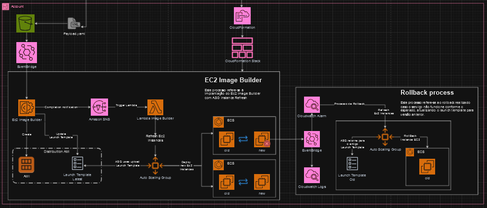

# EC2 Image Builder with Lambda Execution for Instance Refresh

## Descrição

Este template do AWS CloudFormation cria uma solução de EC2 Image Builder que integra um Lambda para gerenciar a atualização das instâncias do Auto Scaling Group (ASG) durante o processo de `instance refresh`. O template configura os recursos necessários para a criação e distribuição de AMIs (Amazon Machine Images) otimizadas para ECS, incluindo uma função Lambda para executar ações durante o refresh das instâncias.
*Conforme diagrama:*

## Parâmetros

- **EnvironmentName**: Nome do ambiente (default: `EC2 Image Builder Sample`).
- **AmazonLinux2023EcsOptimizedAmiId**: ID da AMI otimizada para ECS (default: `ami-05dc81a6311c42a6e`).
- **BuildInstanceType**: Tipo da instância para o Image Builder (default: `t2.micro`).
- **SampleLaunchTemplate**: ID do template de lançamento amostral (default: `lt-037c0c60e5b729431`).
- **SampleAutoScalingGroup**: Nome do grupo de Auto Scaling amostral (default: `ASGDev`).
- **PublicSubnet**: ID da sub-rede pública (default: `subnet-08bc50a595ea13af9`).
- **DefaultSecurityGroup**: ID do grupo de segurança padrão para o Image Builder (default: `sg-0fb049bbf54425e43`).
- **ClusterName**: Nome do cluster ECS para coleta de eventos (default: `ClusterDev`).
- **BucketName**: Nome do bucket S3 para carregar o payload (default: `ec2-imagebuilders3-dev-automation-1`).
- **PreFixName**: Prefixo para carregar o payload (default: `execute-test`).

## Recursos

- **InstanceRefreshHandler**: Função Lambda que gerencia o refresh das instâncias do ASG.
- **InstanceRefreshHandlerLambdaRole**: Role IAM associada à função Lambda com permissões necessárias.
- **ImageBuilderSNSTopic**: Tópico SNS para notificar a função Lambda sobre atualizações do Image Builder.
- **EC2ImageBuilderComponent**: Componente do Image Builder que instala e configura o Apache Web Server.
- **EC2ImageBuilderRecipe**: Receita do Image Builder que usa o componente para criar uma imagem personalizada.
- **EC2ImageBuilderPipeline**: Pipeline do Image Builder que cria e distribui a imagem.
- **EC2ImageBuilderInfrastructureConfiguration**: Configuração de infraestrutura para o Image Builder.
- **EC2ImageBuilderDistributionConfiguration**: Configuração de distribuição da imagem criada pelo Image Builder.
- **ExecutionInlinePolicy**: Política IAM inline para permitir ações necessárias ao Image Builder.
- **EC2ImageBuilderIAMRole**: Role IAM associada à instância do Image Builder.
- **EC2ImageBuilderEventBridge**: Regra do EventBridge para acionar o pipeline do Image Builder.
- **EC2ImageBuilderEventBridgeForEventsECS**: Regra do EventBridge para capturar eventos de erro do ECS.
- **LogGroupforCollectEventsOfServiceECS**: Grupo de logs para coletar eventos do ECS.
- **EC2ImageBuilderEventBridgeAlarm**: Alarme do CloudWatch para monitorar eventos de erro do ECS.

## Como Usar

1. **Criar o Stack**: Faça upload deste template para o AWS CloudFormation e crie um novo stack.
2. **Fornecer Parâmetros**: Insira os parâmetros necessários para configurar o ambiente.
3. **Monitorar Recursos**: Acompanhe os recursos criados e ajuste as configurações conforme necessário.

## Notas

- Certifique-se de que o bucket S3 e as AMIs fornecidos estão configurados corretamente.
- A função Lambda assume que você possui permissões adequadas para interagir com o Auto Scaling, EC2, e SNS.

Se precisar de mais informações ou ajuda com a configuração, consulte a [documentação da AWS](https://docs.aws.amazon.com/).

